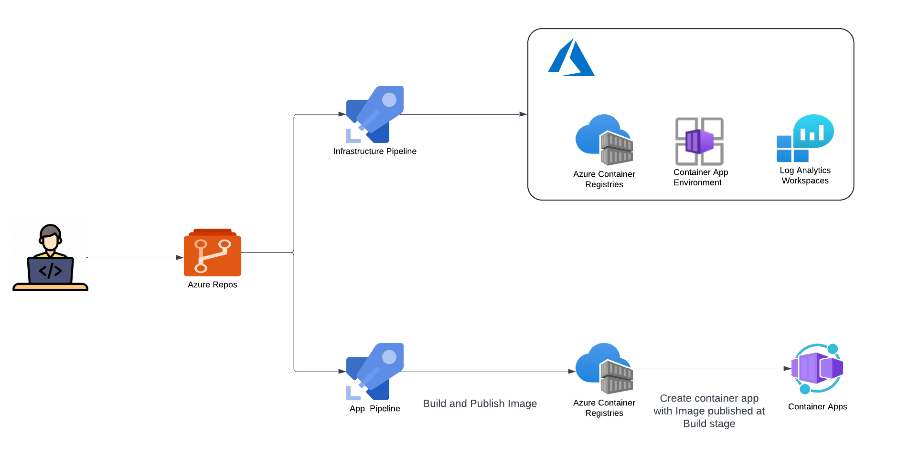

== CICD Strategy
 
The deployment strategy can be segmented into two parts:

* Infrastructure Deployment
* App Deployment

Container App Environment deployment via Infrastructure pipeline, Container App deployment via Application pipeline.

This approach separates the deployment of the Container App Environment and the Container App itself:

* Infrastructure Deployment Pipeline:
** Deploys Container App Environment and other required resources.
** Does not provision the Container App at this stage.

* Application Deployment Pipeline:
** Builds application code and publishes the image to the container registry.
** Provisions the Container App using Terraform with the newly created image.

[source]
----
STACKS-INFRASTRUCTURE-ACA
├── .github              # GitHub-specific configurations and workflows
├── cicd
│   └── build            # CI/CD build configurations
│       ├── azDevOps     # Azure DevOps specific build configurations
│       ├── config       # Configuration files for the build process
│       ├── scripts      # Build-related scripts
│       └── taskctl      # TaskCTL configurations for the build process
├── deploy
│   └── azure            # Terraform configurations for the Core Infra deployment excluding Container App
├── src
│   ├── app              # Application source code
│   └── terraform        # Terraform configurations for the application (Container App)
│   └── aca-vars.yml     # Variables specific to Azure Container App
│   └── deploy-aca.yml   # Deployment configuration for Azure Container App
├── .gitattributes       # Git attributes file
├── .gitignore           # Git ignore file
├── LICENSE              # License file for the project
├── README.md            # Main readme file with project documentation
└── taskctl.yaml         # TaskCTL configuration file
----
