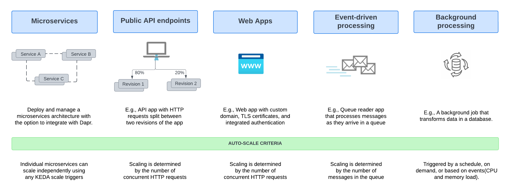

== Introduction

The Azure Container App Project is about building upon the original Stacks philosophy of deployment of applications into Kubernetes Clusters, but providing an alternative method/infrastructure choice for people who want to manage and support their application stack without the prior knowledge Azure Kubernetes Service requires.

Currently this project is very basic, but with future iterations, this will be an alternative selection within the Stacks-CLI project!

Azure Container Apps (ACA) is a fully managed serverless container service for building and deploying modern apps at scale - without managing infrastructure. It builds on top of Kubernetes, offering a fully managed experience for deploying containerized applications without requiring direct access to Kubernetes APIs or cluster management.

Common uses of Azure Container Apps include:

* Deploying API endpoints
* Hosting background processing jobs
* Handling event-driven processing
* Running microservices

